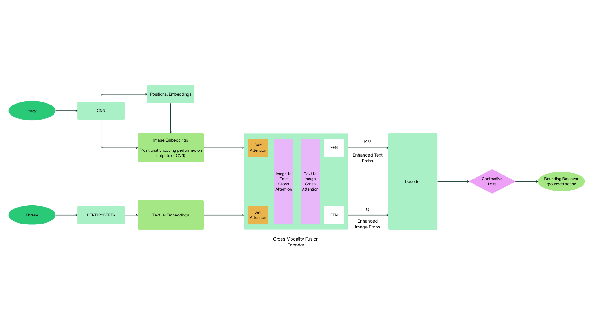

# Scene Grounding

### 1. What this project is about?

This project attempts to try and make a Scene Grounding Model. This project is fully from scratch and takes elements from the **Grounding Dino** and **MDETR** by Microsoft.

#### **How does this work?**

My approach, tried to slightly modify the Transformer approach of MDETR, by replacing the encoder, with an extra **Self-Attention Step** for the individual text and image embeddings and passing the **Enhanced Text Embeddings** as **K,V** of the decoder where the **Enhanced Image Embeddings** were the **Q** values

---

### 2. Setup

```bash
git clone https://github.com/codemaster-vansh/Scene_Grounding
```

Then 

```bash
pip install -r requirements.txt
```

and we can then run our code

---

### 3. Weights - Pretrained

The model weights can be found in this [drive link](https://drive.google.com/drive/folders/1SgfkM8wK9NjwtvzWKRZDtQ9s84zC0hXG?usp=sharing)

---

### 4. Model Diagram


---

### 5. Files Setup

The repository contains 

- scripts
  - config_io.py
  - Model.ipynb
  - Prepare_Dataset.ipynb
  - utils.py
  - Visualize_Prediction.ipynb
- LICENSE
- Model_Diagram.png
- README.md
- requirements.txt

---

### 6. Reference Papers

- [Grounding Dino](https://arxiv.org/abs/2303.05499)

- [MDETR](https://arxiv.org/abs/2203.03605)

---

### 7. Contact

If you have any suggestions regarding my projects - you can reach out to me over here at [my email](mailto:vanshwhig24@gmail.com)

**Thanks for Reading**